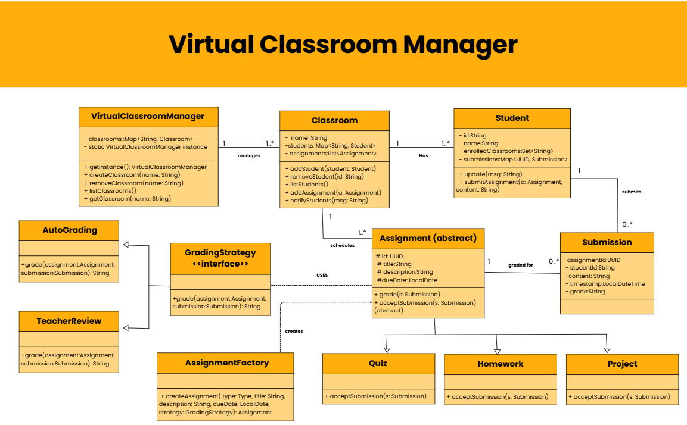

# Virtual Classroom Manager

A console-based Java application that helps manage classrooms, students, and assignments.
this coding exercise and demonstrates Object-Oriented Programming (OOP), SOLID principles, Data Structures and common Design Patterns.

Class Diagram:
 class diagram illustrates the overall architecture of the Virtual Classroom Manager and highlights the relationships and responsibilities of each class.

 

  

Features:

- Classroom Management – Create, list, and remove classrooms.

- Student Management – Enroll students into classrooms and view enrolled students.

- Assignment Management – Schedule assignments for classrooms and allow students to submit.

- Notifications – Students are notified when a new assignment is added (Observer Pattern).

STEP-BY-STEP CODE FLOW:

The execution flow of the Virtual Classroom Manager is as follows:

1.Program Start (Main.java)

- Displays a menu of options in the console.

- User chooses an action (e.g., create classroom, enroll student, schedule assignment).

2.VirtualClassroomManager (Singleton)

- Ensures only one instance of the manager exists.

- Delegates operations to manage classrooms (createClassroom, listClassrooms, etc.).

3.Classroom Operations

- createClassroom(name) → Adds a new Classroom to the system.

- addStudent(student) → Enrolls a Student into the classroom.

- listStudents() → Prints all enrolled students.

- addAssignment(assignment) → Schedules an Assignment.

4.Observer Pattern

- When a new assignment is added, the Classroom automatically notifies all enrolled students.

- Each Student receives an update(msg) message.

5.Assignment Creation (Factory Method)

 - AssignmentFactory.createAssignment(type, ...) decides which subclass to instantiate:

     -Quiz

     -Homework

     -Project

6.Student Submission

- Student calls submitAssignment(assignment, content) → Creates a Submission.

- The submission is linked to both the student and the assignment.

7.Grading (Strategy Pattern)

- Each assignment has a GradingStrategy.

- Two strategies exist:

         - AutoGrading → Assigns a grade immediately.

         - TeacherReview → Marks submission as pending teacher review.

8.Error Handling:

- If invalid input or missing classroom/assignment occurs → custom exceptions are thrown.

Expected OUTPUT:

--- Virtual Classroom Manager ---
1. Create Classroom
2. List Classrooms
3. Remove Classroom
4. Add Student to Classroom
5. List Students in Classroom
6. Schedule Assignment
7. Submit Assignment
0. Exit
Choose:1
Classroom name: Math101
Classroom [Math101] has been created.
Choose: 2
Classrooms:
- Math101
Choose: 3
Classroom name: Math101
Oct 01, 2025 1:58:49 PM VirtualClassroomManager removeClassroom
INFO: Classroom [Math101] removed.
Classroom [Math101] removed.
Choose: 4
Classroom name: Math101
Student ID: S001
Student Name: Harshini
Oct 01, 2025 2:00:18 PM Classroom addStudent
INFO: Student [S001] has been enrolled in [Math101].
Student [S001] has been enrolled in [Math101].
Choose: 5
Classroom name: Math101
Students in Math101:
- S001 - Harshini
Choose: 6
Classroom name: Math101
Assignment type (QUIZ/HOMEWORK/PROJECT): QUIZ
Title: Linear Algebra
Description: 12 mcq is given answer is carely and submit before deadline!!
Due date (YYYY-MM-DD): 2025-10-02
Grading (AUTO/TEACHER): AUTO

Oct 01, 2025 2:02:41 PM Classroom scheduleAssignment

INFO: Assignment scheduled for [Math101]: Linear Algebra
Assignment scheduled for [Math101].

Notification to Student [S001]: New assignment: Linear Algebra in classroom Math101
Oct 01, 2025 2:02:41 PM Student update

INFO: Notification to Student [S001]: New assignment: Linear Algebra in classroom Math101

Assignment scheduled for Math101 with ID: 8addcf87-e590-43c8-8caa-559aa86ffc80
Choose: 7
Classroom name: Math101
Student ID: S001
Assignment ID: 8addcf87-e590-43c8-8caa-559aa86ffc80
Submission content: answers.png

Assignment submitted by Student [S001] in [Math101].
Oct 01, 2025 2:04:25 PM Student submitAssignment

INFO: Assignment submitted by Student [S001] in [Math101], assignment: 8addcf87-e590-43c8-8caa-559aa86ffc80
Oct 01, 2025 2:04:25 PM AutoGrading grade

INFO: Auto-graded submission 8addcf87-e590-43c8-8caa-559aa86ffc80 for student S001: 11
Submission auto-graded. Score: 11

Design Patterns Implemented:

- Singleton → Ensures only one VirtualClassroomManager instance exists.

- Factory Method → Creates different types of assignments (Quiz, Homework, Project).

- Observer → Classroom notifies enrolled Students when a new assignment is added.

- Strategy (optional/bonus) → Supports different grading strategies (AutoGrading, TeacherReview).

Libraries Used:

- java.util → Collections (Map, List, Set), UUID, Scanner

- java.time → Date and time handling

- java.util.logging → Logging events and errors

Data Structures Used:

- Map<String, Classroom> → To store and manage classrooms efficiently.

- Map<String, Student> → For quick lookup of students in a classroom.

- Map<UUID, Submission> → To manage submissions by assignment ID.

- List<Assignment> → To maintain ordered assignments in each classroom.

- Set<String> → To track classrooms a student is enrolled in (prevents duplicates).

OOP Used:

- Encapsulation – Private fields, accessed via getters/setters.

- Abstraction – Assignment is abstract; specific types extend it.

- Inheritance – Quiz, Homework, and Project extend Assignment.

- Polymorphism – Different grading strategies can be applied dynamically.

SOLID Principles Applied:

- Single Responsibility – Each class handles one responsibility.

- Open/Closed – New assignment types can be added without modifying existing code.

- Liskov Substitution – Subclasses (Quiz, Homework) can replace Assignment.

- Interface Segregation – Students only implement what they need (Observer methods).

- Dependency Inversion – High-level modules depend on abstractions (GradingStrategy).

