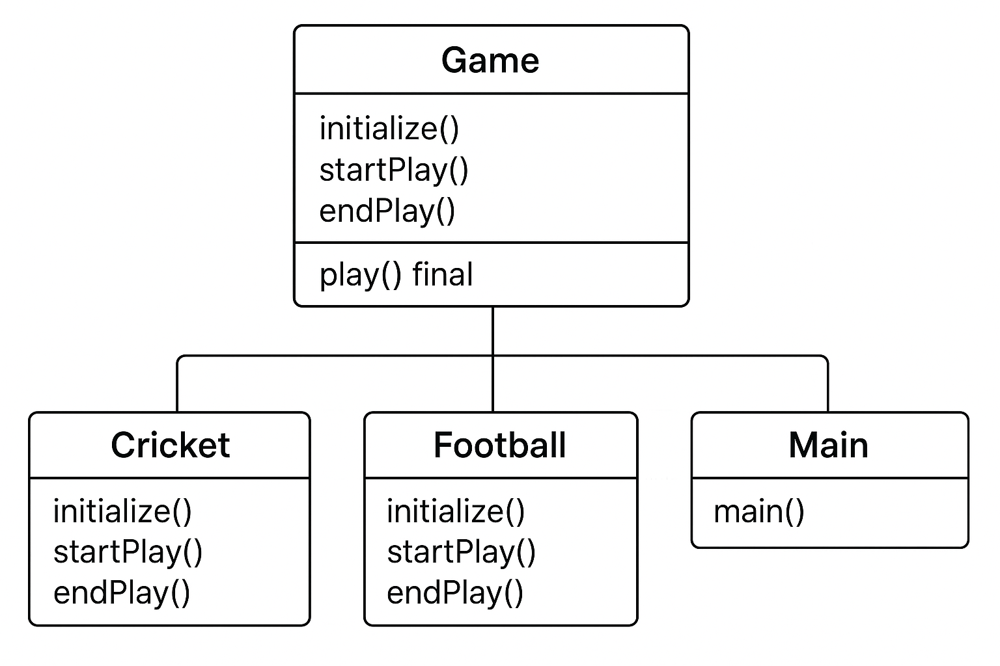

# Template Method

Define the skeleton of an algorithm in a method, deferring some steps to subclasses.

Code Flow Explanation:

This example demonstrates a game system where different games (Cricket, Football) follow the same template (initialize, start, end) but implement each step differently.

Class Diagram:

  

Step-by-Step Code Flow:

1. Game Abstract Class (Game.java)
   - Purpose: Defines the template method and algorithm structure
   - Methods: Abstract initialize(), startPlay(), endPlay()
   - Template Method: play() defines the algorithm structure
   - Represents: The algorithm template

2. Cricket Class (Cricket.java)
   - Purpose: Concrete implementation of the game template
   - Behavior: Implements game-specific initialization, start, and end
   - Represents: One specific algorithm implementation

3. Football Class (Football.java)
   - Purpose: Another concrete implementation of the game template
   - Behavior: Implements football-specific initialization, start, and end
   - Represents: Another specific algorithm implementation

How to Execute the Code:
1. Navigate to the template-method folder in terminal:
   cd behavioural/template-method

2. Compile all Java files:
   javac *.java

3. Run the main program:
   java Main

Expected Output:
=== Template Method Pattern Demo ===

Cricket Game Initialized! Start playing.
Cricket Game Started. Enjoy the game!
Cricket Game Finished!

Football Game Initialized! Start playing.
Football Game Started. Enjoy the game!
Football Game Finished!

Key Takeaways:
1. Algorithm Structure: Template method defines the fixed algorithm structure
2. Customizable Steps: Abstract methods allow step customization
3. Consistent Flow: All implementations follow the same order
4. Code Reuse: Common logic is shared in the template
5. Easy Extension: New implementations only need to implement specific steps

